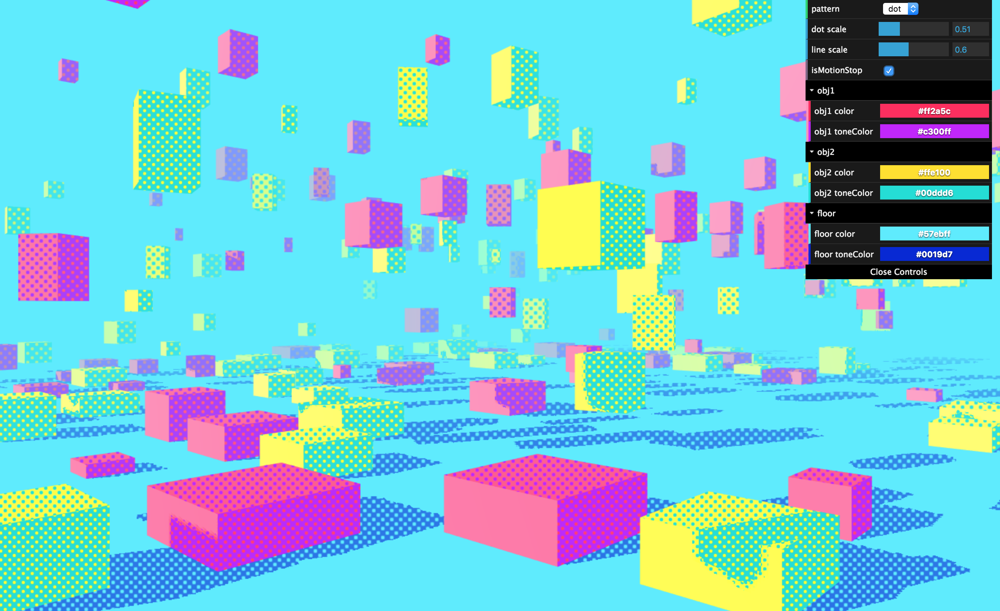
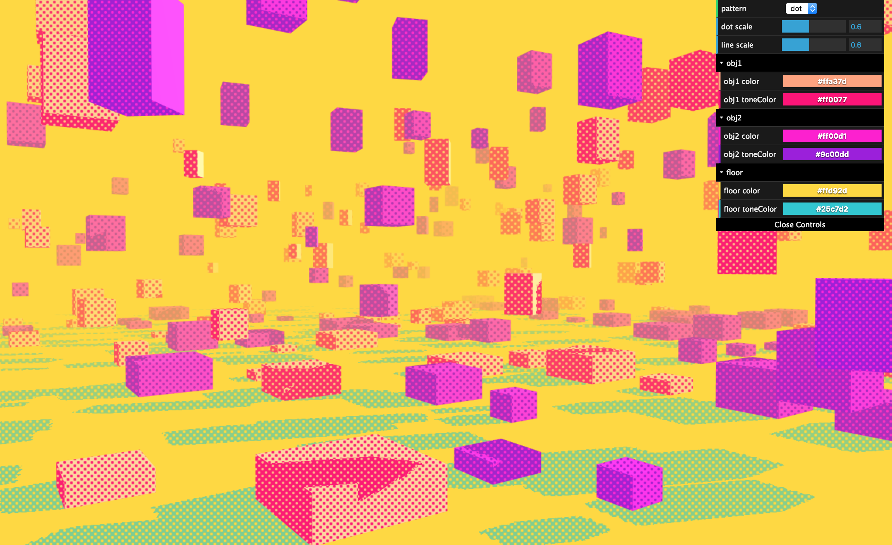
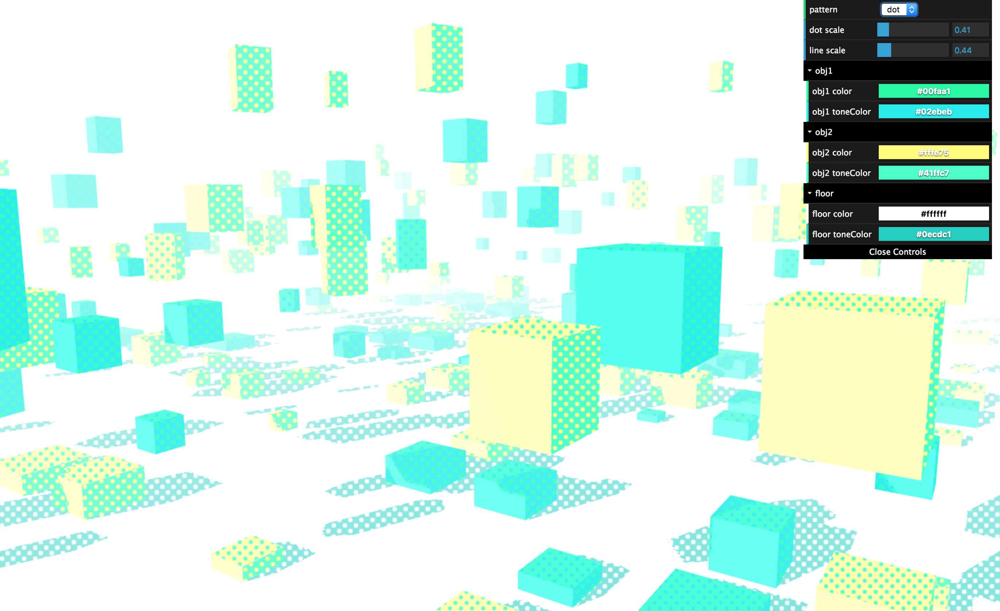

# Halftone Effect
* [demo](https://mnmxmx.github.io/halftone-effect/dst/)  
  
[](./screenshot1.png)  
[](./screenshot2.png)  
[](./screenshot3.png)  
  
## Resources   
* [halftone(in Japanese)](https://wgld.org/d/webgl/w076.html)  
* [line shading(in Japanese)](https://wgld.org/d/webgl/w077.html)  
  
## Usage  
* Clone repository  
* Install Node.js  
* Run following commands  
```
  npm install  
  npm start  
```

